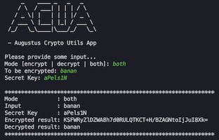
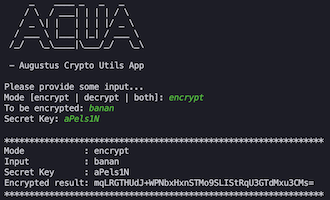
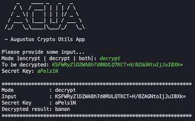

# **Augstus Springfield Crypto**

## Purpose: 

- One place for crypto utils 
- Read secret key from env/sys- or app prop

## Usage
Add maven dependency:
```
<dependency>
    <groupId>com.teliacompany.tiberius.crypto</groupId>
    <artifactId>tiberius-crypto</artifactId>
    <version>2.1.0</version>
</dependency>    
```
If you are using tiberius dependency management then version can be omitted.

## App Usage

The bundled app can be used to generate encrypted passwords, it can also be used to decrypt if you know the secret.

Simply build and run the Crypto app jar
```
mvn clean install
java -jar target/tiberius-crypto-starter-2.1.0-SNAPSHOT.jar
```
Or run CryptoApp class from your IDE

### Examples

  


## Working with git

This repository has two remotes that should be in sync:
* Github: https://github.com/telia-company/tiberius-crypto-starter
* Bitbucket: https://diva.teliacompany.net/bitbucket/projects/DCCOMMON/repos/tiberius-crypto

The master repo is in __GitHub__ and the pipeline in github is responsible for promoting and setting new development versions.

### Remove / rename the current remote
If you have cloned this from either github or bitbucket, rename that remote to github or bitbucket, or remove it and re-add it using command below.

Run ```git remote -vv``` to show what remotes currently exist
Run ```git remote rm origin```

### Add remote(s) that is missing:
* ```git remote add github git@github.com:telia-company/tiberius-crypto-starter.git```
* ```git remote add bitbucket ssh://git@diva.teliacompany.net:7999/dccommon/tiberius-crypto.git```

### Set default upstream remote
```git branch --set-upstream-to github/master```

### Verify remotes

Run ```git remote -vv``` again and you should have:
```
bitbucket	ssh://git@diva.teliacompany.net:7999/dcvt/tiberius-crypto.git (fetch)
bitbucket	ssh://git@diva.teliacompany.net:7999/dcvt/tiberius-crypto.git (push)
github   	git@github.com:telia-company/tiberius-crypto-starter.git (fetch)
github      git@github.com:telia-company/tiberius-crypto-starter.git (push)
```

## Release to "Classic" (Bitbucket/jenkins pipeline)

If you have the remote repos set up like above you can simply run the ```jenkins-release.sh``` script.
It will fetch all tags and find the latest one, the check-out the commit for that tag
and push it to bitbucket/master. Finally, it will check-out master again.
